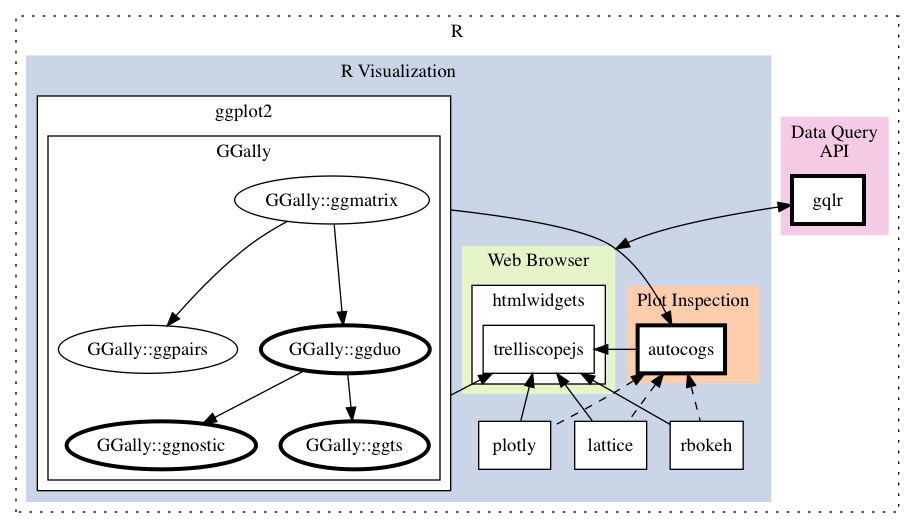

# [Generalized Plot Matrices, Automatic Cognostics, and Efficient Data Exploration](http://thesis.schloerke.com) 

## Timeline

* Nov 3rd
  * Submit thesis to committee
* < Nov 28th
  * Make defense slides
  * Submit thesis acceptance form
* Nov 29th - 10am - HAAS 111
  * Defense (~50m)
* < Dec 3rd
  * Make committee changes to thesis
* <= Dec 3rd
  * Finalize thesis acceptance form, then
  * Submit thesis online to Graduate School
* Dec 6th
  * Electronic Thesis Deposit meeting
* Dec 17th - 2:30pm start - Elliot Hall
  * Graduation Ceremony
